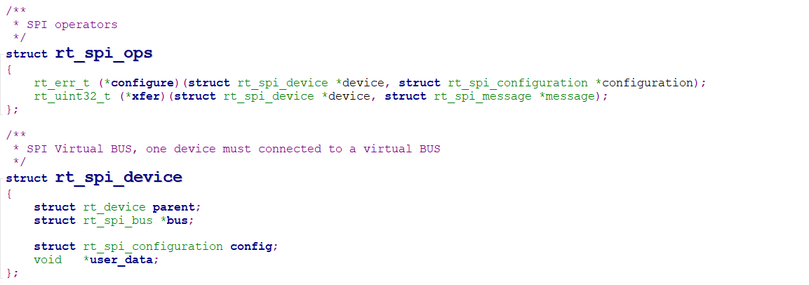
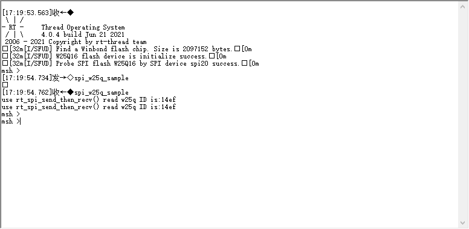

## 说明
RT-Thread为W25Q16外部flash提供的底层驱动文件主要有spi_core.c和spi_dev.c，文件位于`rt-thread-master\rt-thread\components\drivers\spi`目录下。
**spi_core.c**主要是进行SPI总线的初始化以及SPI设备读写操作，其中包含的接口文件如下：
|      **函数**    |        **描述** |
|        :--       |        :--      |
| rt_spi_bus_register() | SPI总线设备注册 |
| rt_spi_bus_attach_device() | 挂载SPI设备 |
| rt_spi_configure() | 配置SPI设备 |
| rt_spi_send_then_send() | 连续发送两次 |
| rt_spi_send_then_recv() | 先发送后接收 |
| rt_spi_transfer() | 传输一次数据 |
| rt_spi_transfer_message() | 自定义传输数据 |
| rt_spi_take_bus() | 获取总线 |
| rt_spi_release_bus() | 释放总线 |
| rt_spi_take() | 片选置1 |
| rt_spi_release() | 片选置0 |
该文件下除了**注册** 和 **挂载**函数外的其他操作方法，都是基于SPI设备的操作方法回调函数实现的。

> rt_spi_bus_register()函数调用了spi_dev.c中的rt_spi_bus_device_init()；
> rt_spi_bus_attach_device()函数调用了spi_dev.c中的rt_spidev_device_init()；

**spi_dev.c**主要是进行SPI设备初始化，并将SPI设备接口 和 SPI总线操作接口关联到一起。这两个文件都属于底层驱动文件；

RT-Thread还提供了SPI的硬件驱动文件**drv_spi.c**，该文件基于硬件本身实现了SPI设备接口函数的具体功能，即完成了之前回调函数的实现并进行关联。

## SPI初始化
> 在rtconfig.h文件中要有宏定义BSP_USING_SPI的支持；

rt_hw_spi_init() -> rt_hw_spi_bus_init() ->  rt_spi_bus_register() -> rt_spi_bus_device_init() -> rt_device_register()；

其中基于硬件实现SPI设备的操作方法如下所示：

## W25Q16
> 在rtconfig.h文件中要有宏定义BSP_USING_SPI_FLASH的支持；

SPI Flash的初始化文件spi_flash_init.c，使用rt_hw_spi_flash_init()函数初始化SPI Flash，初始化过程为rt_hw_spi_flash_init() -> rt_hw_spi_device_attach() -> rt_spi_bus_attach_device() -> rt_spidev_device_init();

RT-Thread还为SPI Flash提供了**SFUD串行flash驱动库**，用于驱动SPI 串行Flash。
> SFUD的github地址：https://github.com/armink/SFUD

## 实验现象
